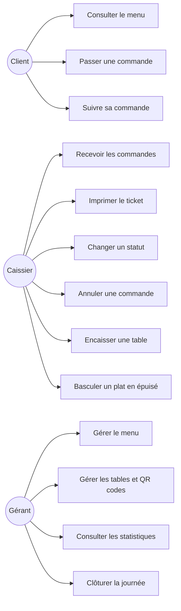
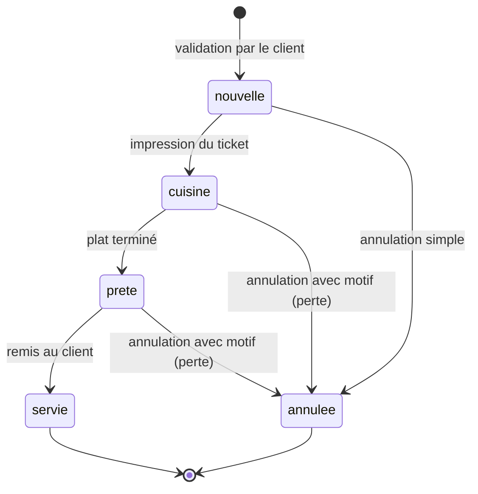
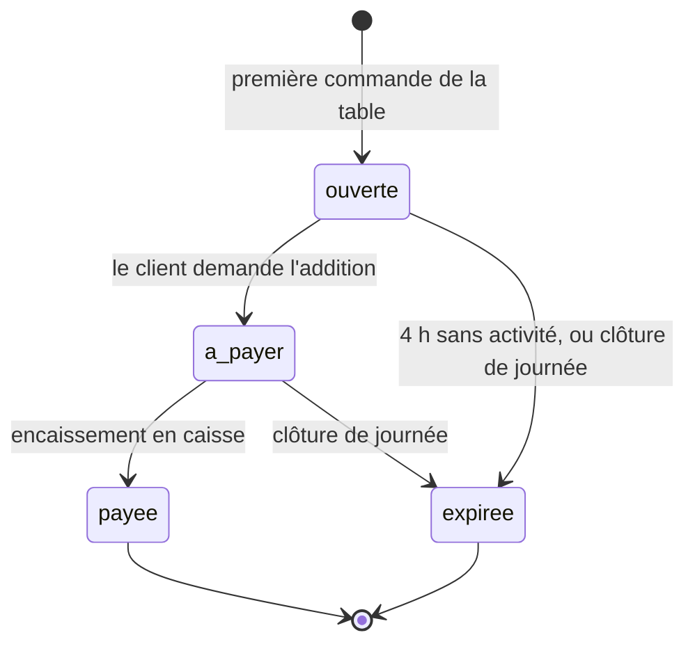

# Phase 2 — Analyse des besoins

## 2.1 Besoins fonctionnels

### Client

| ID | Besoin | Priorité |
|---|---|---|
| BF1 | Accéder au menu du restaurant en scannant le QR code de sa table | Vitale |
| BF2 | Consulter les plats avec visuel, description, déclinaisons et prix | Vitale |
| BF3 | Composer une commande et en connaître le montant avant envoi | Vitale |
| BF4 | Choisir la langue d'affichage (français, arabe, anglais) | Importante |
| BF5 | Joindre une remarque libre à sa commande | Importante |
| BF6 | Indiquer son prénom pour que le plat lui soit remis directement | Importante |
| BF7 | Connaître une estimation du temps d'attente | Secondaire |
| BF8 | Suivre l'état de sa commande jusqu'à ce qu'elle soit prête | Importante |
| BF9 | Passer une nouvelle commande pendant le repas, rattachée à la même addition | Vitale |

### Caissier

| ID | Besoin | Priorité |
|---|---|---|
| BF10 | Recevoir les commandes en temps réel, avec alerte sonore | Vitale |
| BF11 | Visualiser les commandes **regroupées par table** | Vitale |
| BF12 | Imprimer un ticket destiné à la cuisine | Vitale |
| BF13 | Réimprimer un ticket perdu ou illisible | Importante |
| BF14 | Faire évoluer l'état d'une commande (prête, servie) | Importante |
| BF15 | Annuler une commande, avec motif si elle est déjà lancée | Vitale |
| BF16 | Encaisser une table et connaître le montant total dû | Vitale |
| BF17 | Basculer un plat en « épuisé », visible immédiatement par les clients | Importante |

### Gérant

| ID | Besoin | Priorité |
|---|---|---|
| BF18 | Gérer le menu : plats, déclinaisons, prix, visuels | Vitale |
| BF19 | Gérer les tables et éditer leurs QR codes à imprimer | Vitale |
| BF20 | Consulter le chiffre d'affaires de la journée | Importante |
| BF21 | Identifier les plats les plus vendus et les heures de pointe | Secondaire |
| BF22 | Clôturer la journée et figer le chiffre d'affaires | Importante |

## 2.2 Besoins non fonctionnels

| ID | Besoin | Exigence mesurable |
|---|---|---|
| BNF1 | Réactivité du temps réel | Commande visible en caisse en moins de 3 s |
| BNF2 | Accessibilité client | Aucune installation, aucun compte, aucune permission navigateur |
| BNF3 | Performance sur réseau dégradé | Premier affichage du menu en moins de 3 s en 3G |
| BNF4 | Compatibilité | Navigateurs mobiles Android et iOS récents |
| BNF5 | Multilingue | Français, anglais, arabe avec sens de lecture inversé |
| BNF6 | Intégrité tarifaire | Un prix ne peut jamais provenir du navigateur du client |
| BNF7 | Cloisonnement | Un restaurant ne peut accéder à aucune donnée d'un autre |
| BNF8 | Traçabilité | Toute annulation et tout encaissement sont journalisés |
| BNF9 | Coût d'exploitation | Nul pour un restaurant sur les plans gratuits |
| BNF10 | Simplicité d'usage | Poste caisse utilisable après une démonstration de 10 min |

BNF6 et BNF7 sont les deux exigences structurantes de sécurité : elles justifient à elles
seules le choix d'écrire en base par procédures et non directement depuis le navigateur.

## 2.3 Cas d'utilisation

### UC2 — Passer une commande (scénario nominal)

| # | Acteur | Action |
|---|---|---|
| 1 | Client | Scanne le QR code de sa table |
| 2 | Système | Identifie la table par son jeton et affiche le menu disponible |
| 3 | Client | Sélectionne des plats et leurs déclinaisons |
| 4 | Client | Saisit son prénom et, éventuellement, une remarque |
| 5 | Client | Valide la commande |
| 6 | Système | Vérifie la disponibilité, calcule le total **en base**, rattache la commande à la session de la table |
| 7 | Système | Diffuse la commande vers le poste caisse |
| 8 | Système | Affiche au client le numéro de commande et la fourchette d'attente |

### UC2 — Scénarios alternatifs

| Cas | Comportement attendu |
|---|---|
| 2a. Jeton de table inconnu ou table désactivée | Message d'erreur, aucune commande créée |
| 5a. Panier vide | Validation impossible |
| 6a. Un plat est passé en « épuisé » entre l'affichage et la validation | **La commande entière est refusée** avec un message explicite — servir un panier amputé serait pire |
| 6b. La table n'a aucune session ouverte | Une session est ouverte automatiquement |
| 6c. Deux clients de la même table valident simultanément | Les deux commandes rejoignent la **même** session ; les numéros restent distincts |
| 7a. Le poste caisse est hors ligne | La commande est enregistrée et apparaîtra à la reconnexion |

### UC7 — Annuler une commande

| Cas | Comportement attendu |
|---|---|
| Commande non imprimée | Annulation simple, sans justification |
| Commande déjà imprimée | **Motif obligatoire**, annulation tracée, montant comptabilisé en perte |
| Commande déjà annulée | Opération refusée |

## 2.4 Règles de gestion

| ID | Règle |
|---|---|
| RG1 | Une table ne peut avoir qu'**une seule** session ouverte à la fois |
| RG2 | Toutes les commandes d'une session forment **une seule addition** |
| RG3 | Un plat est toujours commandé via une **déclinaison**, même s'il n'en a qu'une |
| RG4 | Le prix est **figé** au moment de la commande et ne suit pas les modifications ultérieures du menu |
| RG5 | L'impression du ticket constitue l'**engagement de production** et fait passer la commande en cuisine |
| RG6 | Une commande annulée après impression est comptabilisée comme **perte**, jamais effacée |
| RG7 | C'est la **session** qui est payée, jamais la commande individuelle |
| RG8 | Un plat indisponible ne peut pas être commandé |
| RG9 | Les numéros de commande sont séquentiels par restaurant et par **journée d'exploitation** |
| RG10 | La journée d'exploitation se termine à une heure paramétrable (4 h par défaut), pas à minuit |
| RG11 | Une session sans activité depuis 4 h est expirée automatiquement |
| RG12 | Les sessions expirées sont **exclues** du chiffre d'affaires mais conservées |
| RG13 | Le prénom du convive est déclaratif et n'est **jamais** utilisé comme moyen de contrôle |
| RG14 | Le temps d'attente est une **indication** sous forme de fourchette, jamais un engagement |

## 2.5 Machines à états

### Commande

L'état `payee` **n'existe pas** sur la commande : le paiement porte sur la session (RG7).

### Session de table

## 2.6 Données manipulées

| Entité | Description | Volumétrie estimée (1 restaurant) |
|---|---|---|
| Restaurant | Établissement et ses paramètres | 1 |
| Table | Emplacement physique porteur d'un QR code | 10 à 30 |
| Catégorie | Regroupement de plats | 5 à 10 |
| Plat | Article du menu | 20 à 80 |
| Déclinaison | Taille ou format avec son prix | 1 à 3 par plat |
| Session | Couvert, unité de facturation | 30 à 80 par jour |
| Commande | Envoi effectué par un convive | 60 à 200 par jour |
| Ligne de commande | Déclinaison et quantité | 150 à 600 par jour |

Ordre de grandeur : moins de 100 000 lignes par an et par restaurant. Aucune contrainte
de volumétrie — le plan gratuit suffit largement.

## 2.7 Données personnelles

Le système ne collecte **ni compte, ni téléphone, ni adresse, ni moyen de paiement**.

La seule donnée personnelle est le **prénom déclaratif** du convive (BF6). Il est saisi
librement, non vérifié, et n'a d'utilité que pendant le service. Il doit être purgé à la
clôture de journée, alors que les montants sont conservés pour les statistiques.

Cette purge est une décision restant à formaliser (D16, phase 3).

## 2.8 Registre des décisions

Les décisions de cadrage sont consignées dans [`decisions.md`](decisions.md).
Elles sont référencées dans les autres documents sous la forme `D1`, `D2`, etc.
