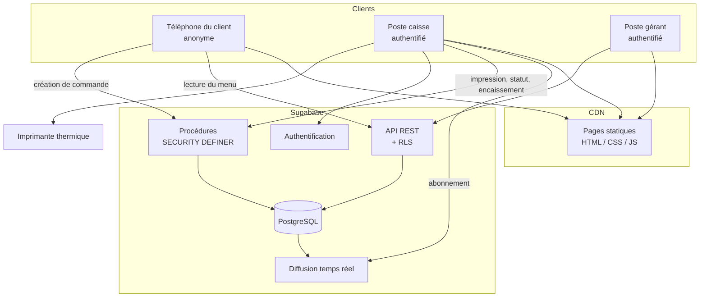
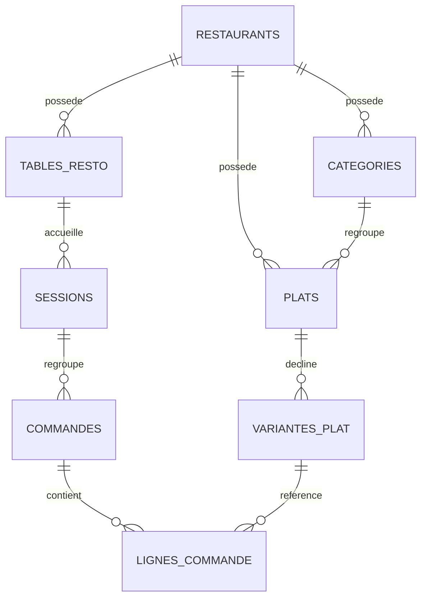
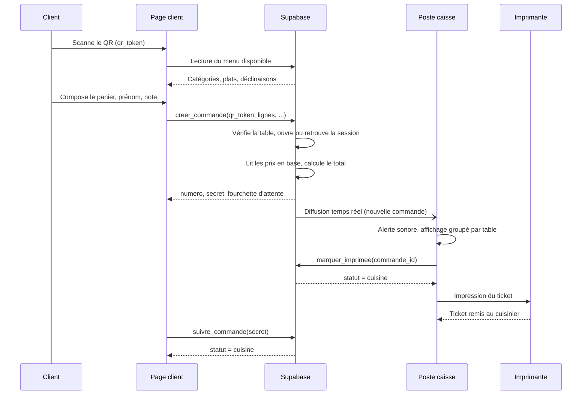

# Phase 3 — Conception

## 3.1 Style d'architecture

**Jamstack multi-tenant, trois niveaux, sans serveur applicatif, pilotée par les événements.**

| Terme | Ce que ça signifie ici |
|---|---|
| **Jamstack** | Le front est statique et servi par un CDN ; tout le dynamique passe par des appels d'API depuis le navigateur |
| **Trois niveaux** | Présentation (les pages) · Logique métier (PostgreSQL) · Données (PostgreSQL) |
| **Sans serveur applicatif** | Aucun serveur à écrire ni à administrer — la base de données managée expose directement l'API |
| **Pilotée par les événements** | Le poste caisse **s'abonne** et reçoit une notification poussée ; il n'interroge pas en boucle |
| **Multi-tenant** | Une seule instance sert tous les restaurants, cloisonnés par `restaurant_id` |

**Justification par la contrainte BNF9 :** un restaurant ne peut pas payer d'hébergement ni
administrer un serveur. Cette architecture a un coût d'exploitation nul et aucune
administration système.

## 3.2 Vue d'ensemble

## 3.3 Modèle de données

Le schéma complet figure dans
[`../supabase/migrations/0001_init.sql`](../supabase/migrations/0001_init.sql).

### Choix de conception notables

| Choix | Justification |
|---|---|
| `sessions` entre table et commandes | D1 — unité de facturation |
| Index unique partiel sur les sessions ouvertes | Garantit RG1 **au niveau de la base**, pas dans le code applicatif |
| `lignes_commande.prix_unitaire` et `libelle` figés | RG4 — un changement de tarif ne doit pas réécrire l'historique, et un ticket réimprimé doit être identique à l'original |
| `plat_id` dénormalisé dans les lignes | Simplifie les statistiques par plat, qui devraient sinon passer par les déclinaisons |
| `plats.archive` au lieu d'une suppression | Les commandes passées référencent encore le plat |
| `commandes.secret` | Permet au client de suivre sa commande sans exposer celles des autres tables |
| Table `compteurs_journee` | D11 — deux commandes simultanées obtiendraient sinon le même numéro |

## 3.4 Sécurité

### Principe directeur

> Le navigateur du client n'est **jamais** une source de confiance.

Deux conséquences structurantes :

**Aucun prix ne transite depuis le client (BNF6).** La procédure `creer_commande` reçoit
uniquement des identifiants de déclinaisons et des quantités. Les tarifs sont lus en base
et le total y est recalculé. Modifier le JavaScript de la page n'a aucun effet.

**Aucune écriture directe n'est autorisée.** Les tables `commandes`, `sessions` et
`lignes_commande` n'ont aucune politique d'insertion ni de mise à jour. Le seul chemin
d'écriture passe par des procédures `SECURITY DEFINER`.

### Cloisonnement (BNF7)

Le `restaurant_id` est porté par le jeton d'authentification, dans `app_metadata` —
zone modifiable uniquement par la clé de service. Placer cette information dans
`user_metadata` permettrait à un caissier de lire les données d'un autre restaurant.

**Point de vigilance :** `SECURITY DEFINER` contourne les politiques RLS. Chaque procédure
destinée à la caisse revérifie donc explicitement `restaurant_id = mon_restaurant()`.
C'est l'erreur classique sur cette architecture.

### Matrice des droits

| Ressource | Anonyme | Caisse | Gérant |
|---|---|---|---|
| Menu (catégories, plats, déclinaisons) | Lecture | Lecture | Lecture / Écriture |
| Disponibilité d'un plat | — | Écriture | Écriture |
| Créer une commande | Procédure | — | — |
| Suivre sa commande | Procédure (par secret) | — | — |
| Commandes du restaurant | — | Lecture | Lecture |
| Imprimer, changer un statut, annuler | — | Procédure | Procédure |
| Encaisser une session | — | Procédure | Procédure |
| Clôturer la journée | — | Procédure | Procédure |
| Journal d'audit | — | Lecture | Lecture |

## 3.5 Contrat des procédures

| Procédure | Appelant | Entrées | Sortie |
|---|---|---|---|
| `creer_commande` | anonyme | `qr_token`, lignes, prénom, note | `id`, `secret`, `numero`, `total`, fourchette d'attente |
| `suivre_commande` | anonyme | `secret` | `numero`, `statut`, fourchette |
| `marquer_imprimee` | caisse | `commande_id` | — |
| `changer_statut` | caisse | `commande_id`, statut | — |
| `annuler_commande` | caisse | `commande_id`, motif | — |
| `encaisser_session` | caisse | `session_id` | total encaissé |
| `cloturer_journee` | caisse | `restaurant_id` | journée, chiffre d'affaires, sessions orphelines |

### Erreurs normalisées

| Code | Signification | Comportement attendu de l'interface |
|---|---|---|
| `P0002` | Ressource introuvable | Message explicite, pas de nouvel essai |
| `22023` | Requête invalide (panier vide, transition interdite) | Correction par l'utilisateur |
| `23514` | Plat devenu indisponible | Rafraîchir le menu et refaire le panier |
| `42501` | Accès interdit | Déconnexion du poste |

## 3.6 Séquence — passage d'une commande

## 3.7 Interfaces

| Écran | Utilisateur | Contraintes de conception |
|---|---|---|
| **Client** | Anonyme, sur son téléphone | Conçu mobile d'abord, trois langues dont une en lecture inversée, utilisable d'une main, aucun jargon |
| **Caisse** | Caissier, sur PC ou tablette | Lisible à distance, **groupement par table obligatoire** (dispositif de sécurité D3a), alerte sonore, action principale accessible en un clic |
| **Gérant** | Gérant | Consultation avant tout ; gestion du menu et édition des QR codes |

Le **ticket** n'est pas un écran mais un document imprimé, mis en forme par la feuille de
style d'impression : largeur 72 mm, police à chasse fixe, aucune couleur. L'imprimante
thermique est vue comme une imprimante ordinaire, ce qui évite tout pilote spécifique.

## 3.8 Décisions techniques restant à trancher en phase 3

| ID | Sujet | Impact |
|---|---|---|
| D10 | Idempotence des envois sur réseau instable | Un double envoi crée aujourd'hui deux commandes |
| D12 | Coupure internet pendant le service | Aucun mode dégradé prévu |
| D13 | Panne d'imprimante | Aucun repli prévu |
| D15 | Versionnement du menu | Un menu modifié pendant qu'un panier est ouvert |
| D16 | Rétention et purge du prénom | Obligation issue de l'analyse (§2.7) |

Aucune de ces décisions ne bloque la phase 4 : elles portent sur des modes dégradés et des
optimisations, pas sur la structure. Elles doivent être tranchées avant la mise en service
d'un restaurant pilote.

## 3.9 Asymétrie de diffusion (D22)

Le poste caisse et le téléphone du client n'utilisent **pas** le même mécanisme :

| Destinataire | Mécanisme | Exigence de latence |
|---|---|---|
| Poste caisse | Abonnement temps réel, notification poussée | Moins de 3 s (BNF1) |
| Téléphone du client | Interrogation de `suivre_commande` toutes les 10 s | Aucune exigence formelle |

Cette asymétrie est délibérée. Le client anonyme n'a aucun droit de lecture sur
`commandes` ; lui ouvrir un accès partiel permettrait à un tiers de compter les commandes
du restaurant. L'interrogation cesse dès que la commande atteint un état terminal.
