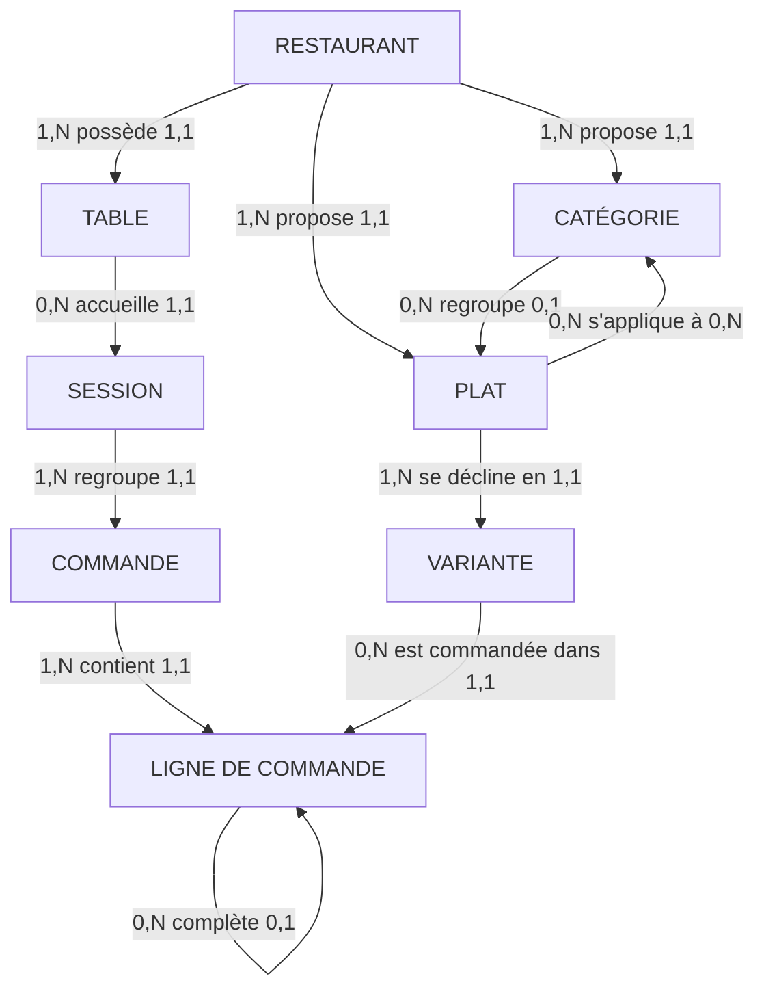

# Modèle de données

Document extrait du schéma réellement déployé (PostgreSQL 17, région Paris).
11 tables, 31 index, 11 politiques de sécurité, 15 procédures, 1 déclencheur.

---

## 1. Modèle conceptuel (MCD)



### Entités

| Entité | Définition métier |
|---|---|
| **Restaurant** | Établissement abonné au service. Porte ses paramètres de fonctionnement. |
| **Table** | Emplacement physique dans la salle, porteur du QR code. |
| **Catégorie** | Regroupement de plats dans la carte (Pizzas, Burgers…). |
| **Plat** | Article de la carte. Un supplément est un plat marqué comme tel. |
| **Variante** | Déclinaison d'un plat portant le prix (Normale, Mega…). |
| **Session** | Le couvert : un groupe installé à une table, unité de facturation. |
| **Commande** | Un envoi effectué par un convive pendant une session. |
| **Ligne de commande** | Une variante et sa quantité dans une commande. |

### Associations remarquables

**`SESSION` entre `TABLE` et `COMMANDE`** — c'est le cœur du modèle (D1). Sans elle, trois
commandes d'une même table seraient trois objets sans lien et le caissier devrait deviner
quoi encaisser. Elle permet aussi que plusieurs convives commandent depuis des téléphones
différents sur une seule addition.

**`LIGNE` réflexive sur elle-même** — une ligne « camembert » pointe vers la ligne
« Burger DZ » qu'elle complète (D5-bis). Le ticket cuisine peut ainsi indiquer sur quel
plat poser le supplément.

**`PLAT` ↔ `CATÉGORIE` en plusieurs-à-plusieurs** — porte la *portée* d'un supplément :
les fromages s'appliquent aux burgers et aux sandwichs, les garnitures sucrées aux crêpes.
Sans elle, l'interface proposait « Kit Kat » sur un burger.

---

## 2. Modèle logique (MLD)

```
restaurants        (#id, nom, ville, fuseau, fin_journee, validation_requise,
                    code_table_requis, eta_active, cree_le)

tables_resto       (#id, restaurant_id°, numero, qr_token, active)
                    UNIQUE (restaurant_id, numero) · UNIQUE (qr_token)

categories         (#id, restaurant_id°, nom_fr, nom_ar, nom_en, ordre)

plats              (#id, restaurant_id°, categorie_id°, nom_fr, nom_ar, nom_en,
                    desc_fr, desc_ar, desc_en, image_url, disponible, archive,
                    ordre, est_supplement)

variantes_plat     (#id, plat_id°, libelle_fr, libelle_ar, libelle_en, prix, ordre)

supplements_categories (#supplement_id°, #categorie_id°)

sessions           (#id, restaurant_id°, table_id°, statut, journee, total,
                    ouverte_le, activite_le, fermee_le)
                    UNIQUE partiel (table_id) WHERE statut IN ('ouverte','a_payer')

commandes          (#id, restaurant_id°, session_id°, numero, journee, statut,
                    nom_convive, note, total, eta_min, eta_max, secret,
                    cree_le, imprimee_le, annulee_apres_impression, motif_annulation)
                    UNIQUE (restaurant_id, journee, numero)

lignes_commande    (#id, commande_id°, variante_id°, plat_id°, quantite,
                    prix_unitaire, libelle, parent_ligne_id°)

compteurs_journee  (#restaurant_id°, #journee, dernier_numero)

journal_audit      (#id, restaurant_id°, commande_id, session_id, action,
                    detail, acteur, cree_le)
```

`#` clé primaire · `°` clé étrangère

---

## 3. Dictionnaire de données

### restaurants

| Colonne | Type | Null | Défaut | Rôle |
|---|---|---|---|---|
| id | uuid | non | `gen_random_uuid()` | Identifiant technique |
| nom | text | non | — | Raison commerciale affichée au client |
| ville | text | non | `'Alger'` | Localisation, affichée sur le ticket |
| fuseau | text | non | `'Africa/Algiers'` | Base du calcul de la journée d'exploitation |
| fin_journee | time | non | `'04:00'` | Heure de bascule de journée. **Pas minuit** : un restaurant ouvert jusqu'à 1 h verrait sinon son service coupé en deux (D21) |
| validation_requise | boolean | non | `false` | Réserve pour D2 : impose une validation du caissier avant la cuisine |
| code_table_requis | boolean | non | `false` | Réserve pour D3a : impose un code du jour en cas d'abus |
| eta_active | boolean | non | `true` | Permet de masquer l'estimation d'attente (D8) |
| cree_le | timestamptz | non | `now()` | Date d'abonnement |

### tables_resto

| Colonne | Type | Null | Défaut | Rôle |
|---|---|---|---|---|
| id | uuid | non | `gen_random_uuid()` | Identifiant technique |
| restaurant_id | uuid | non | — | Cloisonnement multi-tenant (D4) |
| numero | int | non | — | Numéro affiché en salle et sur le ticket |
| qr_token | uuid | non | `gen_random_uuid()` | **Encodé dans le QR code.** Un numéro serait devinable : `/table/1`, `/table/2`… (D3a) |
| active | boolean | non | `true` | Table retirée du service sans supprimer son historique |

### categories

| Colonne | Type | Null | Défaut | Rôle |
|---|---|---|---|---|
| id | uuid | non | `gen_random_uuid()` | Identifiant technique |
| restaurant_id | uuid | non | — | Cloisonnement multi-tenant |
| nom_fr | text | non | — | Libellé français, seul obligatoire |
| nom_ar / nom_en | text | oui | — | Traductions facultatives : un restaurant peut démarrer en français seul (BNF5) |
| ordre | int | non | `0` | Ordre d'affichage dans la carte |

### plats

| Colonne | Type | Null | Défaut | Rôle |
|---|---|---|---|---|
| id | uuid | non | `gen_random_uuid()` | Identifiant technique |
| restaurant_id | uuid | non | — | Cloisonnement multi-tenant |
| categorie_id | uuid | oui | — | Nullable : un plat peut exister hors catégorie |
| nom_fr | text | non | — | Libellé français |
| nom_ar / nom_en | text | oui | — | Traductions facultatives |
| desc_fr / desc_ar / desc_en | text | oui | — | Composition affichée au client |
| image_url | text | oui | — | Photo du plat. Vide aujourd'hui : à défaut, une vignette de catégorie est affichée |
| disponible | boolean | non | `true` | Bascule « épuisé » du caissier, propagée en temps réel (D6) |
| archive | boolean | non | `false` | **Un plat retiré de la carte n'est jamais supprimé** : les commandes passées le référencent |
| ordre | int | non | `0` | Ordre dans la catégorie |
| est_supplement | boolean | non | `false` | Un supplément est un plat marqué. Il hérite ainsi des déclinaisons, de la disponibilité et du prix figé sans table dédiée (D5-bis) |

### variantes_plat

| Colonne | Type | Null | Défaut | Rôle |
|---|---|---|---|---|
| id | uuid | non | `gen_random_uuid()` | Identifiant technique |
| plat_id | uuid | non | — | Plat décliné |
| libelle_fr | text | non | `'Standard'` | Nom de la taille. **La valeur « Standard » est masquée par l'interface** : un plat à prix unique paraît alors n'avoir qu'un prix (D5) |
| libelle_ar / libelle_en | text | oui | — | Traductions facultatives |
| prix | numeric(10,2) | non | — | `CHECK (prix >= 0)`. **Le prix vit ici, jamais sur le plat** : garder les deux créerait deux chemins de lecture et des incohérences |
| ordre | int | non | `0` | Ordre d'affichage des tailles |

### sessions

| Colonne | Type | Null | Défaut | Rôle |
|---|---|---|---|---|
| id | uuid | non | `gen_random_uuid()` | Identifiant technique |
| restaurant_id | uuid | non | — | Cloisonnement multi-tenant |
| table_id | uuid | non | — | Table occupée. `ON DELETE RESTRICT` : on ne supprime pas une table qui a servi |
| statut | text | non | `'ouverte'` | `ouverte` → `a_payer` → `payee`, ou `expiree` |
| journee | date | non | — | Journée d'exploitation de rattachement |
| total | numeric(10,2) | non | `0` | Somme des commandes non annulées. **Dénormalisation assumée** : le caissier a besoin du montant instantanément |
| ouverte_le | timestamptz | non | `now()` | Arrivée du couvert |
| activite_le | timestamptz | non | `now()` | Dernière commande. Base de l'expiration à 4 h (D21) |
| fermee_le | timestamptz | oui | — | Encaissement ou expiration |

### commandes

| Colonne | Type | Null | Défaut | Rôle |
|---|---|---|---|---|
| id | uuid | non | `gen_random_uuid()` | Identifiant technique |
| restaurant_id | uuid | non | — | Cloisonnement multi-tenant |
| session_id | uuid | non | — | Couvert de rattachement |
| numero | int | non | — | Numéro lisible, séquentiel par restaurant **et par journée** (RG9) |
| journee | date | non | — | Journée d'exploitation |
| statut | text | non | `'nouvelle'` | `nouvelle` → `cuisine` → `prete` → `servie`, ou `annulee`. **`payee` n'existe pas ici** : c'est la session qui est payée (RG7) |
| nom_convive | text | oui | — | Prénom déclaratif. Sert au service, **jamais au contrôle** (D3b, RG13). Seule donnée personnelle du système |
| note | text | oui | — | Remarque libre du client |
| total | numeric(10,2) | non | `0` | Recalculé en base, jamais reçu du client (BNF6) |
| eta_min / eta_max | int | oui | — | Fourchette d'attente. Nuls si le restaurant a désactivé l'estimation (D8) |
| secret | uuid | non | `gen_random_uuid()` | Remis au client. **Seul moyen de suivre sa commande** sans exposer celles des autres tables (D22) |
| cree_le | timestamptz | non | `now()` | Horodatage de l'envoi |
| imprimee_le | timestamptz | oui | — | **L'impression est l'acte d'engagement** de production (D2, RG5) |
| annulee_apres_impression | boolean | non | `false` | Distingue l'annulation anodine de la perte sèche (D7) |
| motif_annulation | text | oui | — | Obligatoire après impression |

### lignes_commande

| Colonne | Type | Null | Défaut | Rôle |
|---|---|---|---|---|
| id | uuid | non | `gen_random_uuid()` | Identifiant technique |
| commande_id | uuid | non | — | Commande de rattachement |
| variante_id | uuid | non | — | Déclinaison commandée. `ON DELETE RESTRICT` |
| plat_id | uuid | non | — | **Dénormalisé** : les statistiques par plat passeraient sinon par les variantes |
| quantite | int | non | — | `CHECK (quantite > 0)` |
| prix_unitaire | numeric(10,2) | non | — | **Prix figé** à la commande. Un changement de tarif ne réécrit pas l'historique (RG4) |
| libelle | text | non | — | **Libellé figé.** Un ticket réimprimé doit être identique à l'original |
| parent_ligne_id | uuid | oui | — | Ligne complétée par ce supplément (D5-bis) |

### compteurs_journee

| Colonne | Type | Null | Défaut | Rôle |
|---|---|---|---|---|
| restaurant_id | uuid | non | — | Clé primaire composite |
| journee | date | non | — | Clé primaire composite |
| dernier_numero | int | non | `100` | Incrémenté atomiquement. **Sans cette table, deux commandes simultanées obtiendraient le même numéro** (D11) |

### journal_audit

| Colonne | Type | Null | Défaut | Rôle |
|---|---|---|---|---|
| id | bigint | non | séquence | Identifiant croissant |
| restaurant_id | uuid | non | — | Cloisonnement multi-tenant |
| commande_id / session_id | uuid | oui | — | Objet concerné, sans clé étrangère pour survivre à sa suppression |
| action | text | non | — | `commande_creee`, `ticket_imprime`, `statut_change`, `commande_annulee`, `session_encaissee`, `session_expiree`, `journee_cloturee` |
| detail | jsonb | oui | — | Contexte variable selon l'action |
| acteur | uuid | oui | — | Compte à l'origine. Nul si action automatique |
| cree_le | timestamptz | non | `now()` | Horodatage |

### supplements_categories

| Colonne | Type | Null | Rôle |
|---|---|---|---|
| supplement_id | uuid | non | Plat marqué `est_supplement` |
| categorie_id | uuid | non | Famille de plats à laquelle il s'applique |

**Aucune ligne pour un supplément = applicable partout.** C'est le comportement par défaut,
pour ne pas imposer ce paramétrage à un petit restaurant.

---

## 4. Contraintes d'intégrité

### Portées par la base, pas par le code

| Contrainte | Ce qu'elle garantit |
|---|---|
| `UNIQUE partiel (table_id) WHERE statut IN ('ouverte','a_payer')` | **Une table n'a qu'une seule session ouverte** (RG1). Deux convives tombent forcément sur la même addition |
| `UNIQUE (restaurant_id, journee, numero)` | Pas de doublon de numéro de commande dans une journée |
| `UNIQUE (qr_token)` | Un jeton identifie une seule table |
| `UNIQUE (restaurant_id, numero)` sur les tables | Pas deux « table 5 » dans le même restaurant |
| `CHECK` sur les statuts | Aucun état hors des machines à états définies |
| `CHECK (quantite > 0)`, `CHECK (prix >= 0)` | Valeurs aberrantes impossibles |
| Déclencheur `trg_verifier_supplement` | Un supplément ne se commande pas seul ; un plat ne se rattache pas à un plat ; un supplément n'en porte pas un autre |

Ces règles ne sont **pas** écrites dans le navigateur. Le client n'étant pas authentifié,
tout contrôle placé côté interface serait contournable.

### Comportements de suppression

| Relation | Règle | Motif |
|---|---|---|
| `sessions.table_id` | `RESTRICT` | On ne supprime pas une table qui a servi |
| `lignes_commande.variante_id` | `RESTRICT` | On ne supprime pas une déclinaison déjà commandée |
| `lignes_commande.commande_id` | `CASCADE` | Les lignes n'existent pas sans leur commande |
| `lignes_commande.parent_ligne_id` | `CASCADE` | Retirer un plat retire ses suppléments |
| `plats.categorie_id` | `SET NULL` | Supprimer une catégorie ne détruit pas les plats |

---

## 5. Normalisation

Le schéma est en **troisième forme normale**, avec trois dénormalisations assumées :

| Champ | Pourquoi il duplique une information | Justification |
|---|---|---|
| `sessions.total`, `commandes.total` | Recalculable par somme des lignes | Le poste caisse affiche des montants en continu ; recalculer à chaque rafraîchissement serait coûteux et inutile |
| `lignes_commande.plat_id` | Déductible via la variante | Les statistiques par plat deviendraient une jointure supplémentaire sur la table la plus volumineuse |
| `lignes_commande.libelle` | Reconstituible depuis le plat et la variante | **Ce n'est pas une duplication mais un instantané** : le ticket doit rester identique même si le plat est renommé |

`prix_unitaire` relève de la même logique : ce n'est pas une copie du prix courant, c'est le
prix **au moment de la vente**. Sans lui, une hausse de tarif fausserait rétroactivement
tout l'historique.

---

## 6. Index

31 index au total. Les plus significatifs :

| Index | Requête servie |
|---|---|
| `sessions_ouvertes_idx` (partiel) | Écran caisse : tables en cours. Partiel, donc il reste petit même après des années |
| `commandes_journee_idx` | Statistiques du gérant sur une journée |
| `commandes (restaurant_id, statut)` (partiel) | Compteurs « à imprimer », « en cuisine », « prêtes » |
| `lignes_commande (commande_id)` | Affichage d'une commande |
| `lignes_commande (parent_ligne_id)` | Suppléments d'une ligne |
| Clés étrangères | Ajoutées après audit : sans index couvrant, chaque suppression de parent balaie la table fille |

---

## 7. Volumétrie

| Table | Estimation par restaurant et par an |
|---|---|
| commandes | 20 000 à 70 000 |
| lignes_commande | 50 000 à 200 000 |
| sessions | 10 000 à 30 000 |
| journal_audit | 60 000 à 200 000 |

Moins de 500 000 lignes par an et par restaurant. Aucune contrainte de volumétrie : le
plan gratuit (500 Mo) couvre plusieurs années d'exploitation pour plusieurs établissements.

---

## 8. Données personnelles

Le système ne collecte **ni compte, ni téléphone, ni adresse, ni moyen de paiement**.

La seule donnée personnelle est `commandes.nom_convive` — un prénom saisi librement, non
vérifié, utile uniquement pendant le service. **Sa purge à la clôture de journée reste à
mettre en œuvre** (décision D16, ouverte) : les montants doivent être conservés pour les
statistiques, le prénom non.
