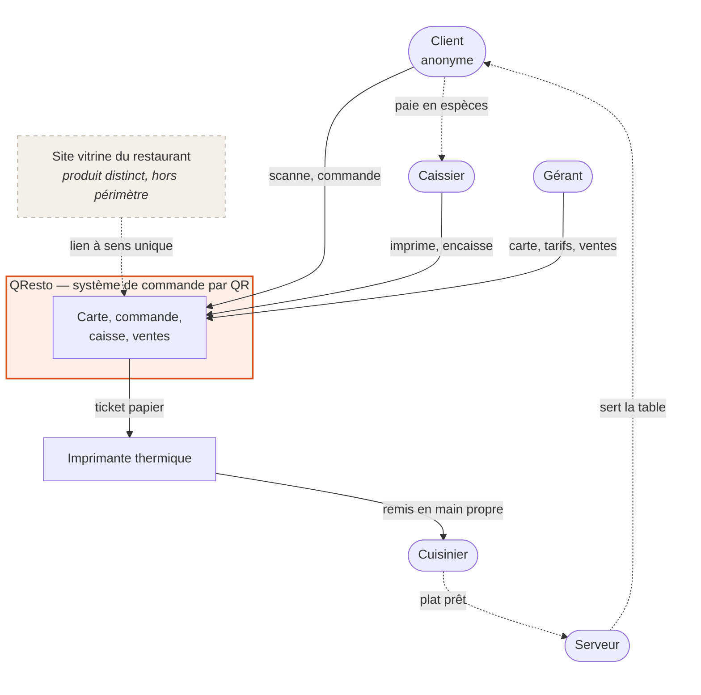
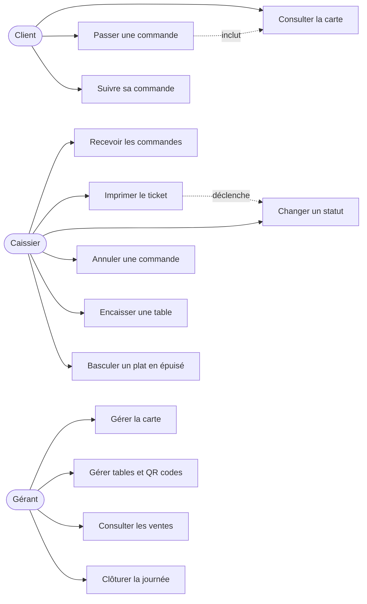
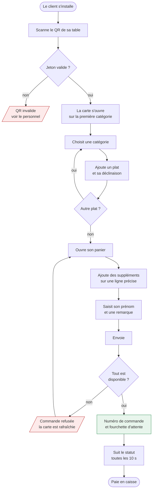
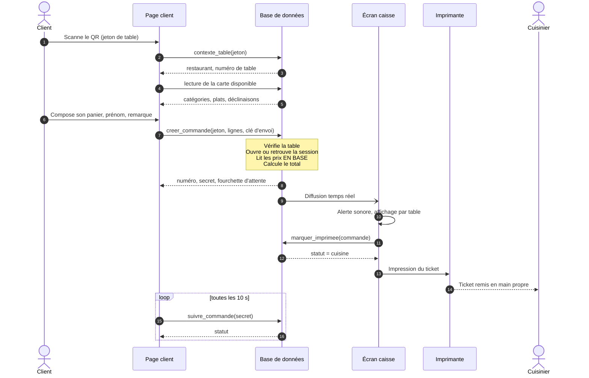
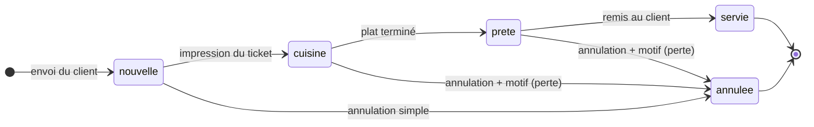
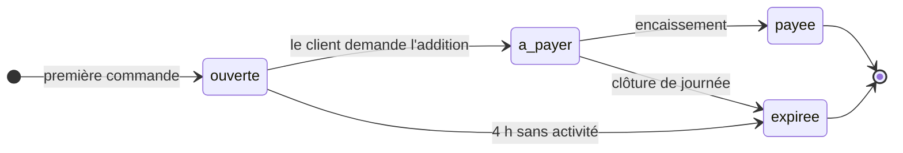
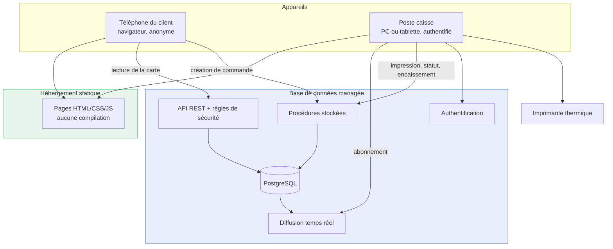
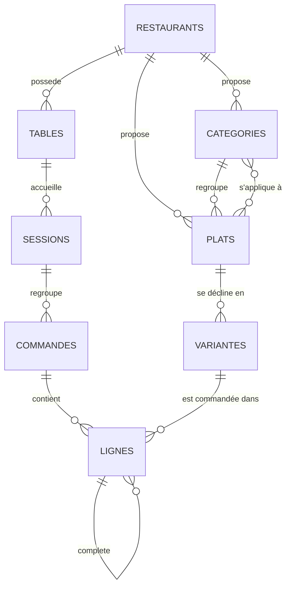
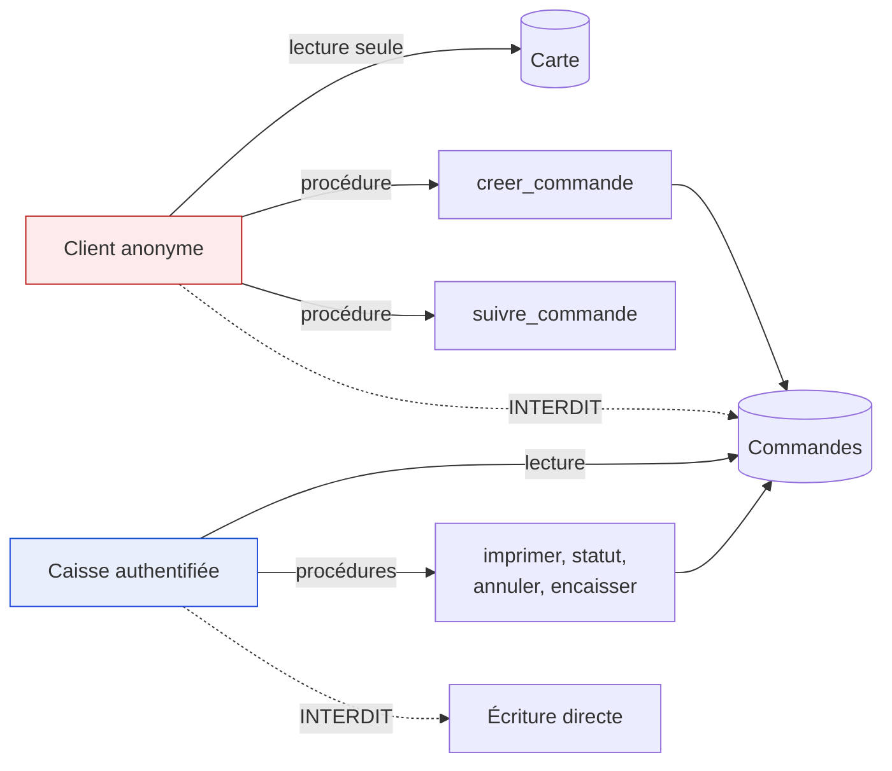

# Diagrammes — QResto

Diagrammes du système tel qu'il est spécifié dans [`cahier-des-charges.md`](cahier-des-charges.md).
Rendus directement par GitHub, aucun outil externe.

---

## 1. Diagramme de contexte

Ce que le système contient, et ce qu'il ne contient pas.

Les flèches en pointillés se déroulent **hors du logiciel**. Le cuisinier et le serveur
sont des acteurs du processus, pas des utilisateurs : c'est délibéré, moins il y a de
personnes à former, plus l'adoption est rapide.

Le site vitrine peut pointer vers la carte. **La carte ne dépend jamais du site.**

---

## 2. Cas d'utilisation

`U5 déclenche U6` traduit une règle métier : **l'impression du ticket fait passer la
commande en cuisine**. C'est l'acte qui engage la production.

---

## 3. Parcours client

Le refus est **total** : si un seul plat du panier vient de passer en « épuisé », la
commande entière est rejetée. Servir un panier amputé serait pire que de le refuser.

---

## 4. Séquence — passage d'une commande

Deux mécanismes différents, et c'est délibéré : **la caisse est notifiée** (moins de 3 s,
exigence N1), **le client interroge** (aucune exigence de latence). Le client anonyme n'a
aucun droit de lecture sur les commandes ; lui en ouvrir permettrait à un concurrent de
compter les ventes du restaurant.

---

## 5. États d'une commande

L'état `payee` **n'existe pas** sur la commande : c'est la session de table qui est payée.

---

## 6. États d'une session de table

Les sessions expirées sont **conservées mais exclues du chiffre d'affaires** : ce sont des
anomalies (client parti sans payer, oubli de clôture), pas des ventes.

---

## 7. Architecture de déploiement

Aucun serveur applicatif à écrire ni à administrer. C'est ce qui rend le coût
d'exploitation nul (exigence N9) — un restaurant ne peut ni payer d'hébergement ni
administrer une machine.

---

## 8. Modèle de données

Trois relations méritent d'être défendues :

**`SESSIONS` entre `TABLES` et `COMMANDES`** — sans elle, trois commandes d'une même table
seraient trois objets sans lien, et le caissier devrait deviner quoi encaisser.

**`LIGNES` réflexive** — un supplément pointe vers la ligne qu'il complète, pour que le
ticket cuisine indique sur quel plat poser le camembert.

**`PLATS` ↔ `CATEGORIES` en plusieurs-à-plusieurs** — la portée d'un supplément : les
fromages sur les burgers, les garnitures sucrées sur les crêpes.

Le dictionnaire complet figure dans [`06-modele-donnees.md`](06-modele-donnees.md).

---

## 9. Sécurité — chemins d'écriture

Principe directeur : **le navigateur du client n'est jamais une source de confiance.**

Aucune table de commandes n'accepte d'insertion directe. Les prix ne transitent jamais
depuis le téléphone : la procédure reçoit des identifiants de déclinaisons et des
quantités, et recalcule le total en base. Modifier le JavaScript de la page n'a aucun
effet.
